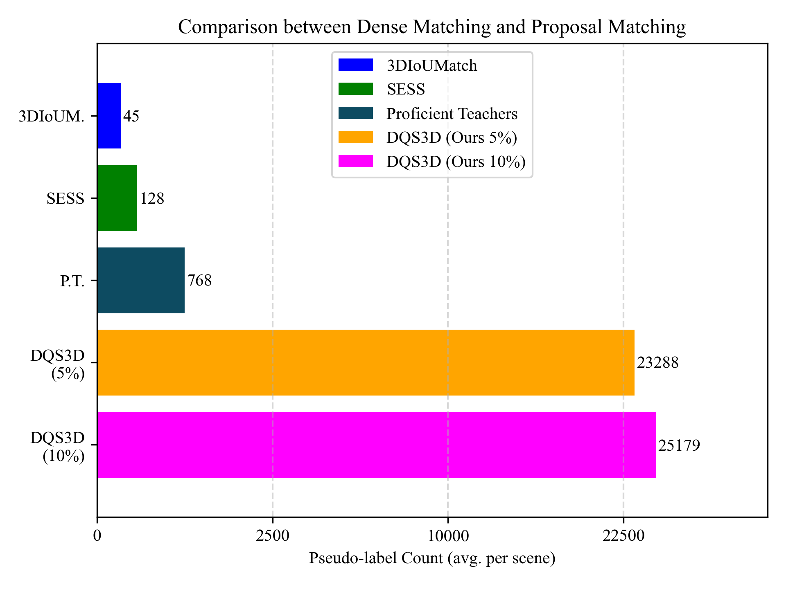

# DQS3D: Densely-matched Quantization-aware Semi-supervised 3D Detection



This repository contains the official implementation of the proposed framework in [manuscript](https://arxiv.org/abs/2304.13031).

> **DQS3D: Densely-matched Quantization-aware Semi-supervised 3D Detection**
>
> Authors: *[Huan-ang Gao](https://c7w.tech/about/), Beiwen Tian, Pengfei Li, [Hao Zhao](https://sites.google.com/view/fromandto), [Guyue Zhou](https://air.tsinghua.edu.cn/en/info/1046/1196.htm)*
>
> [Institute for AI Industry Research (AIR), Tsinghua University](https://air.tsinghua.edu.cn/en/)


## Introduction
> In this paper, we study the problem of semi-supervised 3D object detection, which is of great importance considering the high annotation cost for cluttered 3D indoor scenes. We resort to the robust and principled framework of selfteaching, which has triggered notable progress for semisupervised learning recently. While this paradigm is natural for image-level or pixel-level prediction, adapting it to the detection problem is challenged by the issue of proposal matching. Prior methods are based upon two-stage pipelines, matching heuristically selected proposals generated in the first stage and resulting in spatially sparse training signals. In contrast, we propose the first semisupervised 3D detection algorithm that works in the singlestage manner and allows spatially dense training signals. A fundamental issue of this new design is the quantization error caused by point-to-voxel discretization, which inevitably leads to misalignment between two transformed views in the voxel domain. To this end, we derive and implement closed-form rules that compensate this misalignment onthe-fly. Our results are significant, e.g., promoting ScanNet mAP@0.5 from 35.2% to 48.5% using 20% annotation. Codes and data will be publicly available.


## Environment Preparation

For installing the environment, we follow [FCAF3D](https://github.com/SamsungLabs/fcaf3d) and provide a [Dockerfile](docker/Dockerfile).

Alternatively, you can install the environment manually by reading the instructions provided in the Dockerfile above. You can refer to installation guide of [FCAF3D](https://github.com/SamsungLabs/fcaf3d) for more details.

Most of the `DQS3D`-related code locates in the following files: 
+ [mmdet3d/datasets/semi_supervised_dataset.py](mmdet3d/datasets/semi_supervised_dataset.py)
+ [mmdet3d/models/detectors/semi_single_stage_sparse.py](mmdet3d/models/detectors/semi_single_stage_sparse.py)

And `DQS3D`-related running configs in `configs/fcaf3d/*.py`.

### Getting Started

We follow the `mmdetection3d` data preparation protocol.

You should create folders with prefix `data/scannet` and `data/sunrgbd` for ScanNet and SUN RGB-D datasets, respectively.

Please follow the instructions [here](https://github.com/SamsungLabs/fcaf3d/blob/master/data/scannet/README.md) for ScanNet dataset and [here](https://github.com/SamsungLabs/fcaf3d/blob/master/data/sunrgbd/README.md) for SUN RGB-D dataset for downloading and organizing the data.


**Training**

To start training, run [dist_train](tools/dist_train.sh) with `DQS3D` [configs](configs/fcaf3d):
```shell
bash tools/dist_train.sh <Config Path> <GPU Count>
```

**Testing**

Test pre-trained model using [dist_test](tools/dist_test.sh) with `DQS3D` [configs](configs/fcaf3d):
```shell
bash tools/dist_test.sh <Config Path> <Checkpoint Path> <GPU Count> --eval mAP
```


## Models

We provide you with the bold-styled models in the following table:

**ScanNet**

|              | mAP@0.25 (5%) | mAP@0.50 (5%) | mAP@0.25 (10%) | mAP@0.50 (10%) | mAP@0.25 (20%) | mAP@0.50 (20%) | mAP@0.25 (100%) | mAP@0.50 (100%) |
| ------------ | ------------- | ---- | ------------- | ---- | ------------ | ---- | --------------- | ---- |
| VoteNet      |  27.9 | 10.8 | 36.9 | 18.2 | 46.9 | 27.5 | 57.8 | 36.0 |
| FCAF3D       | 43.8 | 29.3 | 51.1 | 35.7 | 58.2 | 42.1 | 69.5 | 55.1 |
| SESS         | 32.0 | 14.4 | 39.5 | 19.8 | 49.6 | 29.0 | 61.3 | 39.0 |
| 3DIoUMatch   | 40.0 | 22.5 | 47.2 | 28.3 | 52.8 | 35.2 | 62.9 | 42.1 |
| DQS3D (Ours) | **49.2** | **35.0** | **57.1** | **41.8** | **64.3** | **48.5** | **71.9** | **56.3** |
| Improv.      | **+9.2** | **+12.5** | **+9.9** | **+13.5** | **+11.5** | **+13.3** | **+2.4** | **+1.2** |

**SUN RGB-D**

|              | mAP@0.25 (5%) | mAP@0.50 (5%) | mAP@0.25 (10%) | mAP@0.50 (10%) | mAP@0.25 (20%) | mAP@0.50 (20%) | mAP@0.25 (100%) | mAP@0.50 (100%) |
| ------------ | ------------- | ---- | ------------- | ---- | ------------ | ---- | --------------- | ---- |
| VoteNet      | 29.9 | 10.5 | 38.9 | 17.2 | 45.7 | 22.5 | 58.0 | 33.4 |
| FCAF3D       | 49.5 | 31.7 | 50.7 | 33.4 | 54.3 | 36.5 | 63.6 | 47.5 |
| SESS         | 34.2 | 13.1 | 42.1 | 20.9 | 47.1 | 24.5 | 60.5 | 38.1 |
| 3DIoUMatch   | 39.0 | 21.1 | 45.5 | 28.8 | 49.7 | 30.9 | 61.5 | 41.3 |
| DQS3D (Ours) | **53.2** | **35.6** | **55.7** | **38.2** | **58.0** | **42.3** | **64.1** | **48.2** |
| Improv.      | **+14.2** | **+14.5** | **+10.2** | **+9.4** | **+8.3** | **+11.4** | **+0.5** | **+0.7** |


You can download these models at [ [Google Drive](https://drive.google.com/drive/folders/17z8tAGSWrN1_k5qUgGAkv3eJaxQhZNQ5?usp=sharing) | [Tsinghua Cloud Storage](https://cloud.tsinghua.edu.cn/d/1fcc6ffefbd04ce5a6fc/) ].


## Citation
If you find this work useful for your research, please cite our paper:
```bibtex
TODO
```

## Acknowledgement

We build our codebase on [mmdetection3d](https://github.com/OPEN-AIR-SUN/PQ-Transformer) and [FCAF3D](https://github.com/SamsungLabs/fcaf3d).
We also give credits to [Mean Teacher](https://github.com/CuriousAI/mean-teacher), [SESS](https://github.com/Na-Z/sess) and [3DIoUMatch](https://github.com/THU17cyz/3DIoUMatch) for providing comparison methods.
